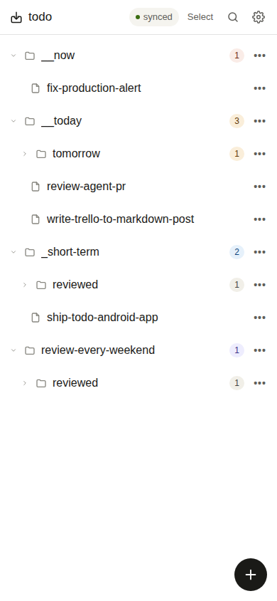
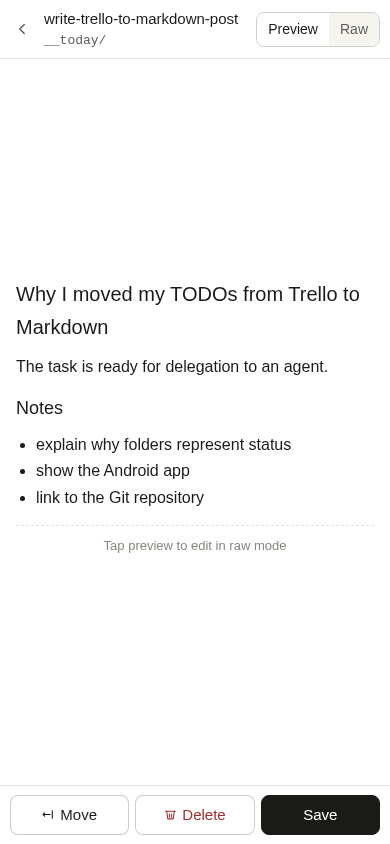
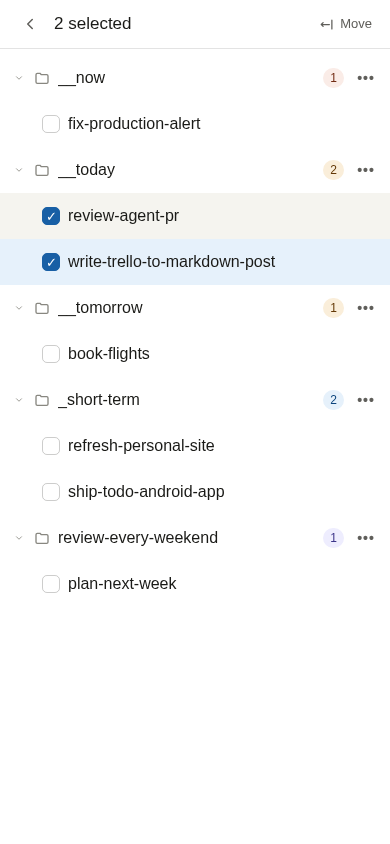

# Todo app

Android-first TODO client for a private Git-backed markdown workflow.

The app is meant to give fast phone access to an existing file-based TODO system without changing the storage format. My primary app for interacting with these TODOs is VS Code, so the repository structure and the daily workflows are already highly opinionated. `todo-app` is designed around that existing shape instead of trying to turn it into a generic checkbox app.

## Product context

This app is designed for one private TODO workflow, not as a collaborative multi-user product. The expected usage is a single user operating on a private repository with a directory layout optimized around daily movement of markdown notes between a few high-traffic folders.

The core idea is simple: TODOs are markdown files in directories such as `__now/`, `__today/`, `_short-term/`, and review folders. The main workflow is not checking a box. The main workflow is moving a file to a different directory that represents its new status.

Representative repository shape:

```text
todo/
  __now/
    todo-app.md
  __today/
    flowlite.md
    mails.md
    publishing.md
  __tomorrow/
    settle-the-tax
  _short-term/
    ief.md
    how-to-live-well.md
  review-every-weekend/
    kuba-badania.md
    health.md
```

The main status directories have workflow meaning:

| Directory | Meaning |
| --- | --- |
| `__now/` | Work that needs immediate attention. |
| `__today/` | The active queue for today. |
| `__tomorrow/` | Tasks deliberately deferred to the next daily pass. |
| `_short-term/` | Near-term work that is not in today's active queue. |
| `review-every-weekend/` | Tasks and ideas revisited during the weekly review. |
| `review-every-zmonth/` | Lower-frequency material revisited in a broader monthly review. |

Review directories now contain their files directly; there is no nested `reviewed/` state. During a review, an item either remains in its review directory for the next cycle or moves to an active status such as `__now/`, `__today/`, `__tomorrow/`, or `_short-term/`.

Core workflows for the app:

- move files between directories as the primary gesture of the app
- treat the file tree as the primary landing view after setup
- open a markdown file into an editable preview with optional raw mode
- publish each confirmed change directly to the repository
- delete the file when the task is done

Everything else in the product follows from that: tree view, editor, sync to GitHub, and conflict handling all exist mainly to support fast file movement across this repository structure.

## Why Git and Markdown

The source-of-truth repository is useful beyond file portability:

- a task that is ready for delegation already lives in a form an agent can read, with nearby project context and documentation
- task descriptions, inline discussions, execution notes, and completed implementation can remain connected through commits
- Git provides a complete history of how a task and its status evolved
- VS Code can be the primary desktop TODO interface, while this Android app and GitHub remain alternative clients for the same data

The app does not introduce another task database or synchronization layer. It is a focused mobile client for the same repository used by the editor and agents.

## Screenshots

The screenshots use a deterministic demo repository rather than private TODO data.

| File tree as the home screen | Markdown preview and editor | Multi-file selection |
| --- | --- | --- |
|  |  |  |

## Product goals

- Browse and filter TODO files and directories.
- Open and edit text files.
- Create, rename, move, and delete files or folders.
- Publish each change to the repository immediately.
- Stay usable on Android first, desktop second.

## MVP scope

- Authentication is done with a GitHub personal access token entered in app settings.
- The app works against a repository and branch provided during first-run setup.
- Each mutating action creates a commit in the target repository.
- Before each mutating action, the app refreshes the latest branch head.
- If the branch moved since the last loaded state and the update cannot be fast-forwarded, the app stops and asks the user to refresh.

This keeps concurrent update handling simple for phase one while avoiding silent overwrites.

## Architecture

## UI shell

- React and TypeScript single-page app.
- Vite for local development and production builds.
- Capacitor Android package with a small Kotlin host.

## Data flow

1. Load repository settings from local storage.
2. Call GitHub REST API to read the branch head, tree, and file contents.
3. Build an in-memory file tree for browsing.
4. On change, create a git tree delta and commit through the GitHub Git Data API.
5. Update the branch reference with `force=false` so concurrent changes fail instead of overwriting remote history.
6. Refresh local state from the new head.

## Concurrency model

- Refresh often.
- Reject writes if the branch head changed since the last synced state.
- Ask the user to reload before retrying.

Detailed practical guidance for mobile conflict handling and VS Code sync habits lives in `docs/concurrency-guidance.md`.

## Security notes

- The MVP stores repository settings in browser storage for speed of implementation.
- For a Play Store release, the token should move to native secure storage.
- The token should be fine-grained and limited to the target repository.

## Development notes

- Local development will use `npm`, Vite, and the browser.
- Android packaging uses Capacitor and produces an installable debug APK with `npm run android:build`.
- Automatic tests should cover repository tree transforms and GitHub API request shaping. Manual exploratory testing should cover real sync behavior with a test repository.

## Local development

```bash
npm install
npm run dev
```

Production build and current unit tests:

```bash
npm run build
npm test
```

Opt-in scripted tests against the real `todo-app-test` repository:

```bash
npx playwright install --with-deps chromium # once per environment for UI tests
npm run test:live
npm run test:live:api
npm run test:live:ui
```

- `test:live` runs both the GitHub API flow and the browser UI flow.
- `test:live:api` runs create, edit, move, and delete through the shared GitHub
  client without opening the app UI.
- `test:live:ui` runs the same repository workflow through the browser UI with
  Playwright.

`live` means that these tests mutate real disposable branches in
`todo-app-test`; They use `TODO_APP_TEST_TOKEN` when it is set,
otherwise they read the PAT from the ignored local `secrets.md`. They enable
`TODO_APP_LIVE_E2E=1` automatically.

## Verification strategy

Verified with a real GitHub-backed test target:

- loading the disposable `todo-app-test` repository
- opening files and reading real remote content
- creating, editing, moving, and deleting files through the app UI
- reloading the tree after publish against real `origin/main`
- conflict-adjacent behavior around stale remote reads, which led to the cache and head-sync fix in the GitHub API layer
- scripted create, edit, move, and delete automation against a disposable `todo-app-test` branch through the shared GitHub API client
- scripted browser-driven create, edit, move, and delete automation against a disposable `todo-app-test` branch through the real app UI

What is still missing on the automated side:

- a dedicated reusable fixture-reset flow if the scripted branch strategy stops being sufficient
